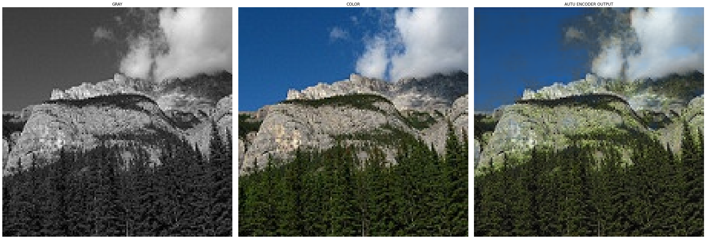
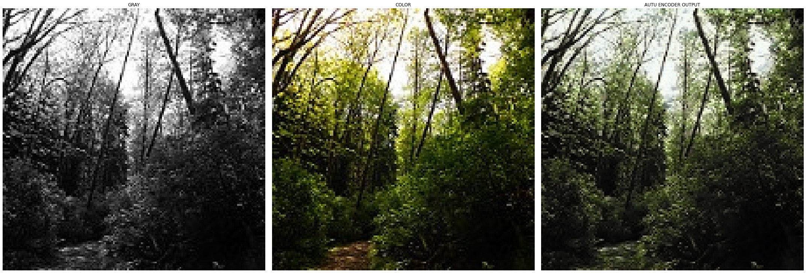
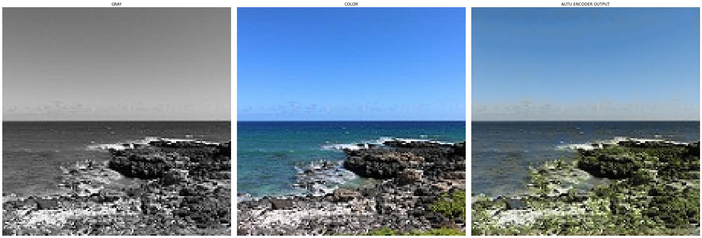
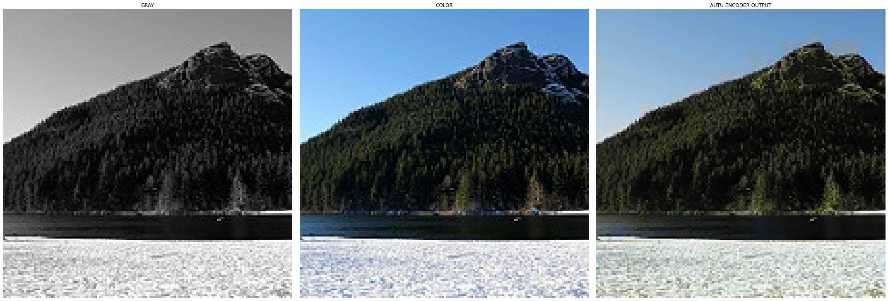

# Image-Colorization-using-Autoencoder-ML-course
An image colorization project using an autoencoder model implemented in PyTorch. The project processes grayscale images, trains the autoencoder on a landscape dataset, and generates colorized versions of the images.

This project implements an autoencoder in PyTorch to perform image colorization. The goal is to colorize grayscale images by training the autoencoder on a dataset of landscape images. The model predicts the color components for each pixel based on its grayscale input.

## Project Workflow
1. **Data Preparation**:  
   - Load and preprocess the dataset.  
   - Split the dataset into training, validation, and test sets.
2. **Model Training**:  
   - Train the autoencoder on the grayscale and color image pairs.  
   - Use validation loss to fine-tune the model.
3. **Visualization and Evaluation**:  
   - Visualize the colorized images generated by the model.  
   - Compare the generated images with the original color images.

## Results
Here are some examples of the results generated by the model:

- **Input (Grayscale)** vs. **Ground Truth (Original Color)** vs. **Generated (Colorized)**:
  
  
  
  
